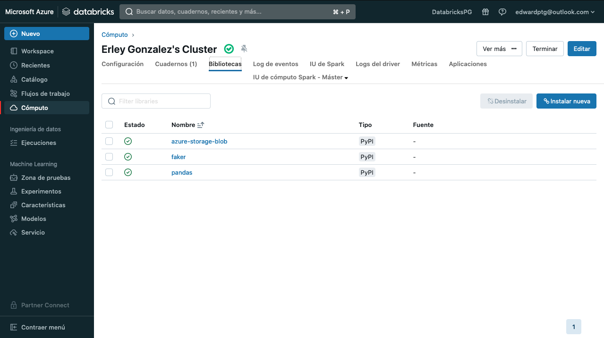
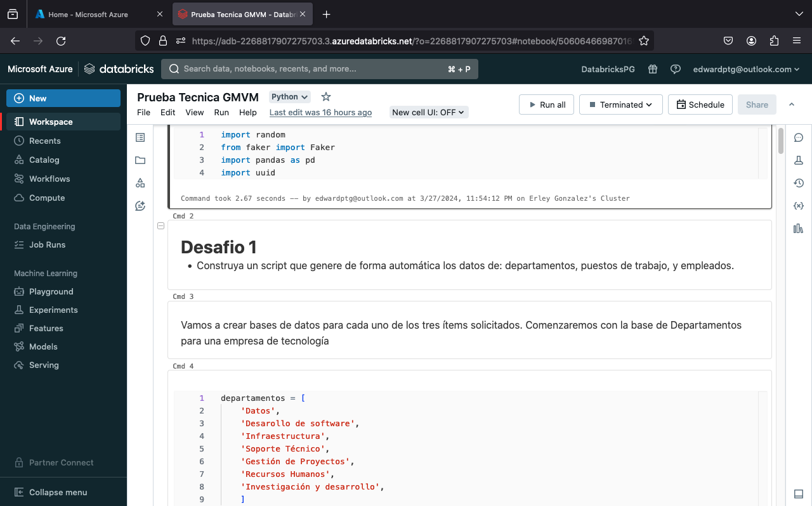
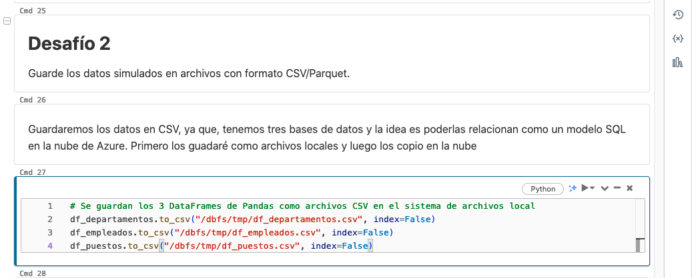
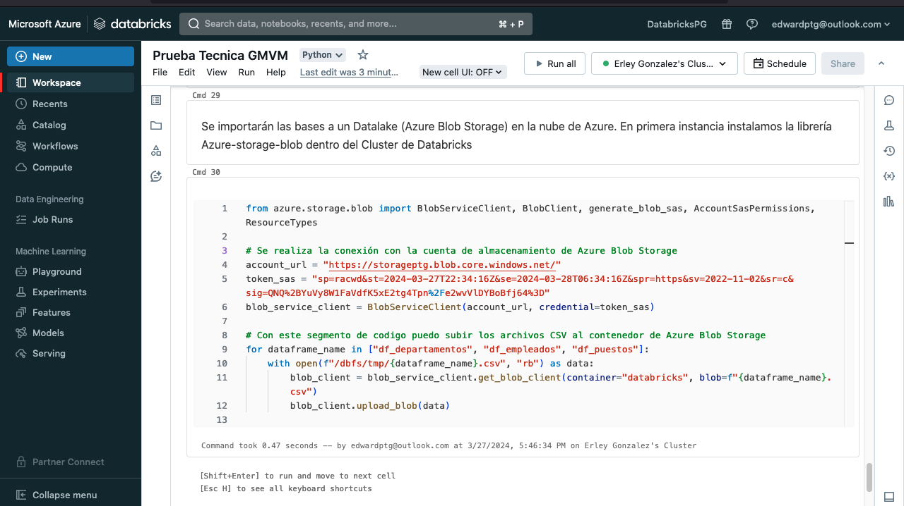
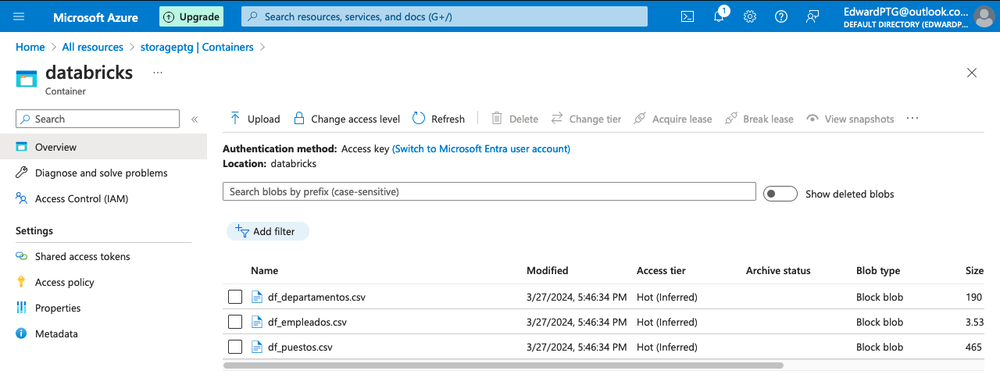
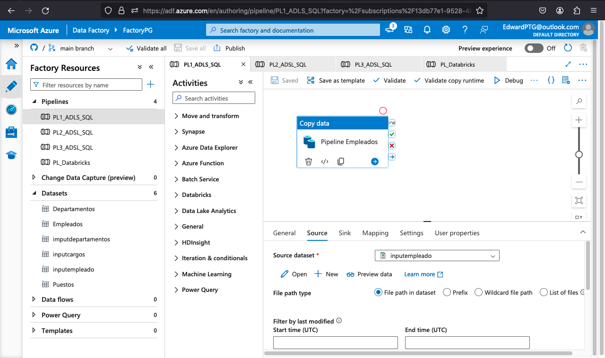
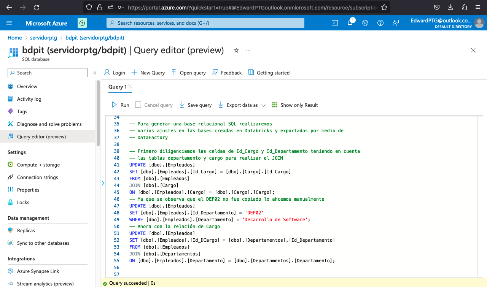
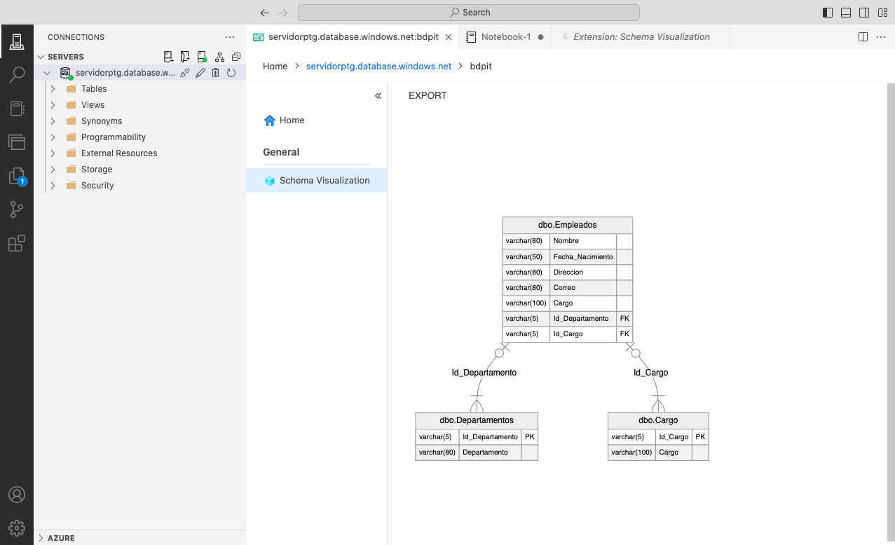

# Ingeniería de Datos

Para la realización e este proyecto utilizamos los recursos de la Nube de Azure. Basicamente utilizamos Databricks Data Factory, Azure Bolb Storage, Azure SQL server, Azure SQL Database. 

## DESAFIO #1: Construya un script que genere de forma automática los datos de: departamentos, puestos de trabajo, y empleados. 

* Para este caso utilizamos el recurso de Databricks de Azure, creamos el Cluster e instalamos las librerías Azure-Blob-Storage, Faker y Pandas para la creación de las bases de datos:

    

* Luego de cargar las librerías realizamos el codigo en un notebook:

     

* El Notebook de databrick se ejecutó como a través de un Pipeline dentro de Datafactory para que cree las bases
si se posee cuenta de Azure se puede consultar el Notebook aquí: [Notebook Databricks ](https://adb-2268817907275703.3.azuredatabricks.net/?o=2268817907275703#notebook/1695174089043602/command/1695174089043603). Para ver el  Notebook como un archivo .ipynb se puede consultar aquí: 

    [Notebook](Desafío_1_A_3/Prueba%20Tecnica%20GMVM.ipynb)

## DESAFIO #2: Guarde los datos simulados en archivos con formato CSV/Parquet. Explique el porqué de la escogencia del formato.  
* Se realiza el guardado de las bases en formato CSV para crear un modelo relacional con Azure Data Studio. Las bases se guardaron en la carpeta temporal de Databricks para luego realizar la migración de las bases a Azure Blob Storage a través de la conexión de Databricks y Blob Storage.

     

## DESAFIO #3: Implemente un proceso batch para migrar los datos a una base de datos SQL/NoSQL, o si lo desea, a un Datawarehouse o bucket analítico de un Datalake.

* Las bases son guardadas dentro de un Data Lake en Azure Blob Storage a través de codigo dentro de databricks (Análogo a bash)

     

    

## DESAFIO #4: Dependiendo si escoge una base de datos SQL/NoSQL, un Datawarehouse, o un Datalake, entonces desarrolle una view/query/report a partir del modelo de datos.

* Utilizando Azure Data Factory y enlazado al repositorio de Github para consultar la ejecución creamos tres Pipelines para realizar la ingesta de datos desde el DataLake a un Datawarehouse alojado en Azure SQl Database. Se puede consultar el proceso en la carpeta [Github](principal/pipeline/)

     

* Luego con QueryPreview y Azure Data Studio creamos el [modelo relacional](ETL-MR.sql) con las tres trablas y generamos en diagrama de entidad relación con la extensión Visualización de Schema. 

    
    
  
* Luego realizamos el view/query/report con la ayuda de Azure Data Studio y un reporte simple en Power BI. En principio utilizamos el Query Editor de Azure Database SQL realizamos las consultas y exportamos el reporte de las consultas que puede consultar aquí:  [Consultas Realizadas ](Desafio_4/API%20Query.ipynb)

* Los resultados de las consultas se pueden observar en esta carpeta [resultados Query](Desafio_4/Resultados/) asímismo en la carpeta [dataset](principal/dataset/) se encuentran los json (Resultados de as query en formato json) que són utilizados para la API Por último se realiza un simple reporte en Power BI para demostrar la conexión con la SQL Database de Azure aquí el [reporte](Reporte.pbix) 

## DESAFIO #5: Desarrolle una API REST para consultar la view/query/report. Para el desarrollo de la API considere algún framework de Python, C#/.Net.

* Para este paso se realizó la ejecución de la API a través de un [Notebook](API.ipynb) de Python con consultas en la página http://localhost:5000/api/... query, sin embargo, el puerto no permitió la ejecución. Se podría utilizar Azure App Web con el mismo codigo de Python pero faltan conocimiento de las conexiones para la ejecución del despliegue `pr ende el tiempo para leer la documentación y realizar el despliegue no es suficiente para la entrega del reto.

## DESAFIO #6: Mejore la implementación de la API realizando un despliegue que use contenedores (valide las distintas opciones que le brinda su nube). Considere una prueba de consumo a la API implementando o activando algún front de acceso para ejecutar la invocación a la view/query/report

* Punto no realizado